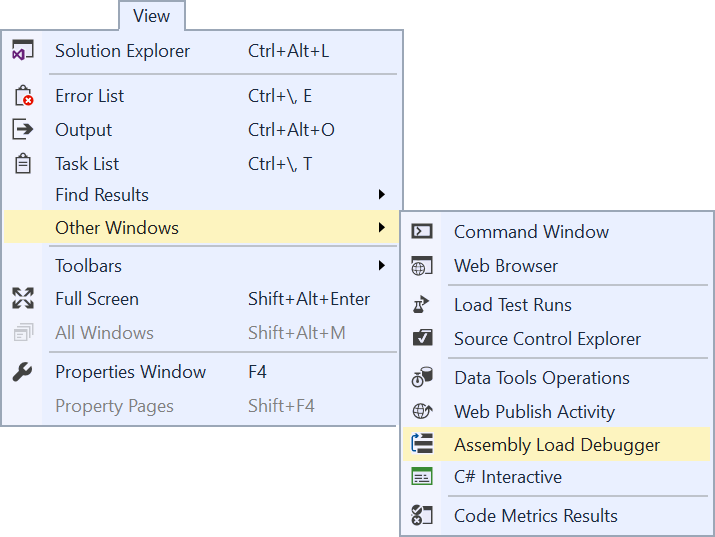
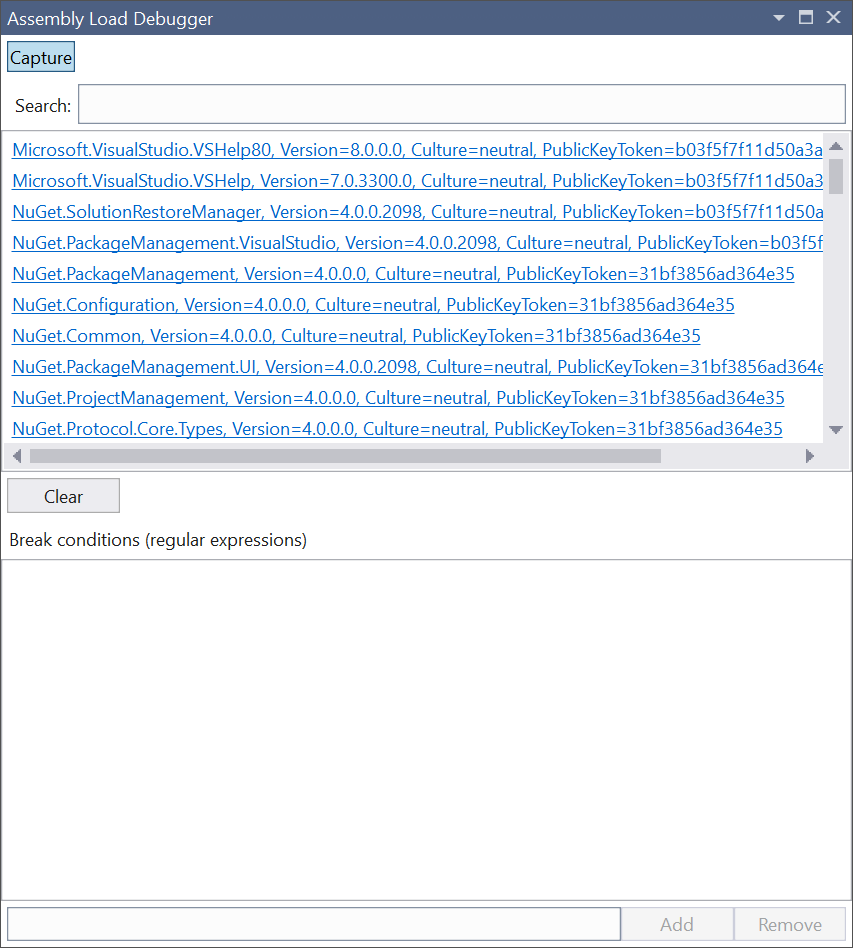

# Assembly Load Debugger

Download this extension from the [Marketplace](https://marketplace.visualstudio.com/vsgallery/10514a28-4247-49a7-b88d-b077471faca5)
or get the [CI build](http://vsixgallery.com/extension/34f00824-cb6a-4bc1-a27d-7375239cdd2f/).

---------------------------------------

Shows what assemblies Visual Studio loads and what component caused it to load

See the [change log](CHANGELOG.md) for changes and road map.

## Features

- Show assemblies loaded

### Show the tool window
Go to View -> Other Windows -> Assembly Load Debugger to open the tool window.

### Capturing assembly load events
Click the Capture button in the tool window to start capturing assembly load events. It will then start listing all the assemblies being loaded by Visual Studio.

### Show the call stack from an assembly load
By clicking on any of the assembly names in the tool window will open a full call stack to help identify what component was responsible for loading the assembly.

Here's [an example](example-callstack.txt) of what such a call stack could look like.

## Contribute
Check out the [contribution guidelines](.github/CONTRIBUTING.md)
if you want to contribute to this project.

For cloning and building this project yourself, make sure
to install the
[Extensibility Tools 2015](https://visualstudiogallery.msdn.microsoft.com/ab39a092-1343-46e2-b0f1-6a3f91155aa6)
extension for Visual Studio which enables some features
used by this project.

## License
[Apache 2.0](LICENSE)
